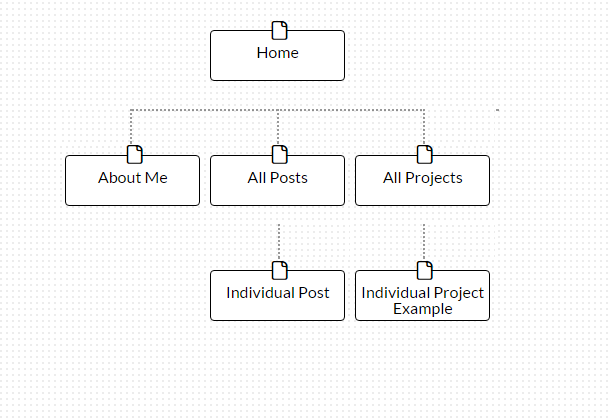

1. What are the 6 Phases of Web Design?  
The 6 phases of web designs are  
* Information Gathering
* Planning
* Design
* Development
* Testing and Delivery
* Maintenance  

2. What is your site's primary goal or purpose? What kind of content will your site feature?  
My site will help me showcase my accomplishments and skills I have developed so far in my career.  

3. What is your target audience's interests and how do you see your site addressing them?  
My target audience's interests are the ways to contact me and to see what projects I have done to prove that I am proficient at a skill. My site will show that by listing out my contact info and social media. Also it will demo all of my past projects to showcase my progress.  

4. What is the primary "action" the user should take when coming to your site? Do you want them to search for information, contact you, or see your portfolio? It's ok to have several actions at once, or different actions for different kinds of visitors.  
The primary action the user should take is to view my portfolio to get a sense of my progress.  

5. What are the main things someone should know about design and user experience?  
The main things someone should know about design and user experience are knowing your end goal for your web site and to prepare yourself to maintain the site to keep it updated in order to keep the site lively.  

6. What is user experience design and why is it valuable?  
User experience design helps make web sites simple, easy to navigate, and appealing for users. This will allow a better and more engaging experience when they are on your site.  

7. Which parts of the challenge did you find tedious?  
I think the planning part of the challenge is tedious but neccesary for a successful web app.  