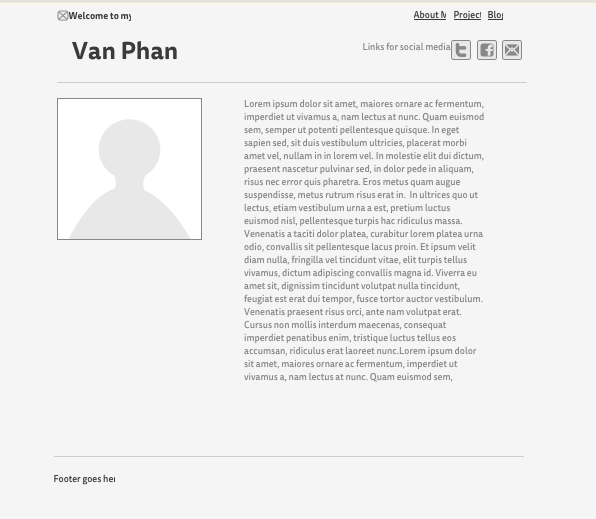
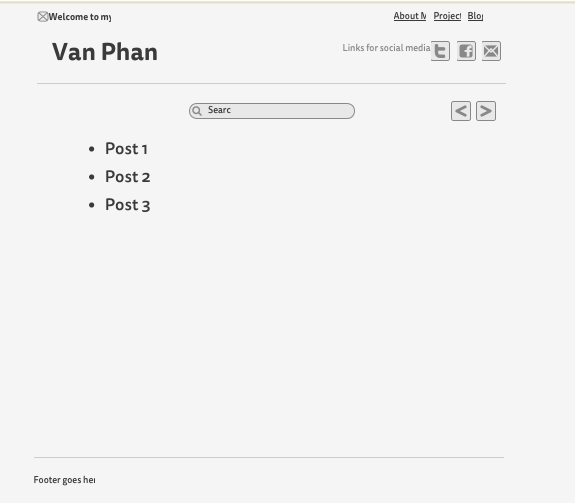

  

1. *What is a wireframe?*  
A wireframe is a rough draft of your website which helps to visualize where different components will be place within the DOM.
2. *What are the benefits of wireframing?*  
You get to edit your decisions by manipulating images instead of rewriting code.
3. *Did you enjoy wireframing your site?*  
I don't really enjoy wireframing, although I know it's neccesary I tend to go overboard with even a rough draft. Therefore I would waste a lot of time perfecting a wireframe at times before I could move on to actually building out the site.  
4. *Did you revise your wireframe or stick with your first idea?*  
I revised a little bit from my initial idea about the layout of my site but I tried to not be so caught up and spend an excess amount of time on just the wireframe.  
5. *What questions did you ask during this challenge? What resources did you find to help you answer them?*  
I asked 'what are the best wireframe sites out there?' and used the link DBC provided on the 10 Free Wireframing Tools for Designers. It was really helpful.  
6. *Which parts of the challenge did you enjoy and which parts did you find tedious?*  
The part of the challenge I enjoyed was researching different types of wireframing sites and seeing which each site has to offer. The tedious part was dragging around images and getting it in the most perfect position.  